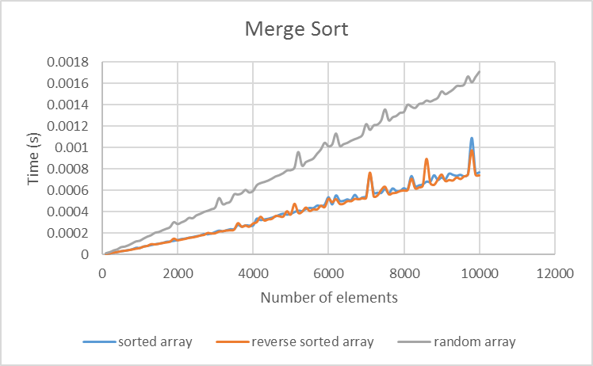
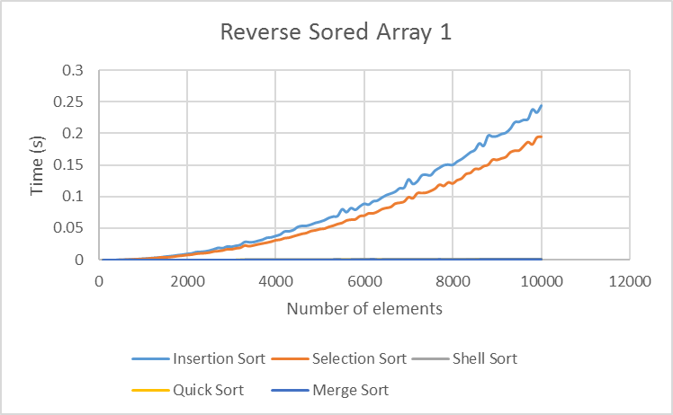

# 数据结构作业报告 #1 

算法分析与排序问题

Copyright &copy; zccz14(陈铮)
Follow CC-BY-NC License
Software Engineering 42
Stu No. 2141601026
email: zccz14@outlook.com

1 程序 A 与程序 B 经过分析发现其最坏情况运行时间分别不大于 $ 150 N \log N $ 和 $ N^2 $。如果可能，请回答下列问题：

$$
150 N \log N < N^2 \to N \ge 1597 \tag{1}
$$

A  对于 $N$ 的大值 ($ N \gt 10000 $)，哪一个程序的运行时间有更好的保障？

由（1）得程序 A 的运行时间有更好的保障。

B  对于 $N$ 的小值 ($ N \lt 100   $)，哪一个程序的运行时间有更好的保障？

由（1）得程序 B 的运行时间由更好的保障。

C  对于 $N = 1000$，哪一个程序平均运行得更快？

不能确定。题设并没有给出平均情况下的时间情况。

D  对于所有可能的输入，程序 B 是否总能够比程序 A 运行得更快？

不能确定。即便是最坏情况，题设也仅仅给了用时上界而不是确界，因此不能判定。

2 考虑以下递归方程，定义函数 $ T(n) $，给出递归式的大 $O$ 表示，并证明。

$$
T(n) = \begin{cases}
  1 & n = 1 \\
  T(n - 1) + n & \text{otherwise} 
\end{cases} 
$$

可以直接展开递归式：

$$
\begin{align}
T(n) & = T(n - 1) + n & n \gt 1 \\
     & = T(n - 2) + (n - 1) + n & n \gt 2 \\
     & = \vdots \\
     & = T(1) + 2 + 3 + \cdots + n & n \ge 1 \\
     & = \sum_{i = 1}^n {i} & n \ge 1 \\
     & = \frac{1}{2} n^2 + \frac{1}{2} n & n \ge 1 \\
\end{align}
$$

所以 $T(n) = O(n^2)$。

$$
T(n) = \begin{cases}
  1 & n = 0 \\
  2 T(n - 1) & \text{otherwise}
\end{cases}
$$

这个也可以直接展开递归式：

$$
\begin{align}
T(n) & = 2 T(n - 1) & n \gt 0 \\
     & = 2^2 T(n - 2) & n \gt 1 \\
     & = \vdots \\
     & = 2^n T(0) & n \ge 0 \\
     & = 2^n & n \ge 0 \\
\end{align}
$$

所以 $T(n) = O(2^n)$。

3 实现直接插入排序、简单选择排序、希尔排序、快速排序和归并排序，以能够对给定数组的正序排序，并按照满足下列情形进行测试：

A 测试数组大小为 $[100, 200, 300, \cdots, 10000]$ 100种大小

B 测试数组中的元素分别为正序、逆序和随机序列



对测试的结果需要用图形的方式进行展示：

测试环境: 

OS: `Ubuntu 14.04 LTS`

Compiler: `gcc (g++)`

Compiler Arguments: `g++ -O0`

a) 展示每个排序算法在满足条件 A 和 条件 B 情形下的运行时间趋势变化图：

b) 将所有排序算法在正序下、逆序下和随机序列下的运行时间的对比图：

4 大小为 $N$ 的数组 A，其主元素是一个出现超过 $\frac{N}{2}$ 次的元素（从而这样的元素最多有一个）。

例如：

数组 $3, 3, 4, 2, 4, 4, 2, 4, 4$ 有一个主元素 $4$

数组 $3, 3, 4, 2, 4, 4, 2, 4$ 没有主元素

使用两种方法实现该问题的求解，并编写程序进行实现。

同时给出两种求解的算法分析。

**方案一**

先排个序($ O(n \log n) $)；

线性维护一个闭区间（滑窗 $O(n)$），使得这个闭区间中的元素彼此相等，然后判断区间的长度（区间内的元素个数）是否超过总元素个数的一半。

总体时间复杂度 $O(n \log n)$，空间复杂度 $O(n)$。



**方案二**

用哈希表直接记录各个元素出现的次数，然后判断最多的元素是否超过了总元素个数的一半。

总体时间复杂度 $O(n)$，空间复杂度 $O(n)$。



> 无序映射 `unordered_map` 使用 Hash 实现，可以在平均 O(1) 的时间内插入、访问特定元素。
> 在这个问题中，元素的大小关系根本就没有用，元素之间的有效关系仅有相等，因此用无序映射即可。

5 选择问题：在一组数据中选择第 $k$ 大数据的问题。请给出你的解决方法，并给出该解决方案的时间性能分析。

**方案一**：

先排个序 $O(n \log n)$，然后取第k大的元素$O(1)$。

总体时间复杂度 $O(n \log n)$，空间复杂度 $O(n)$。



**方案二**：

取快速排序划分的部分加以修改，可以得到一个平均情况下用时 $O(n)$ 的划分算法。

总体时间复杂度 $O(n)$，空间复杂度 $O(n)$。



